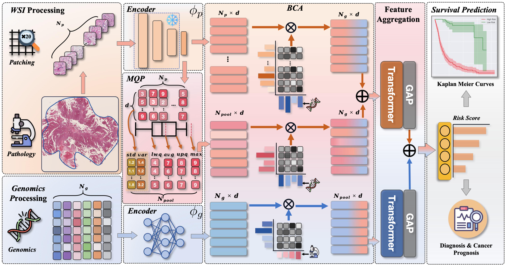
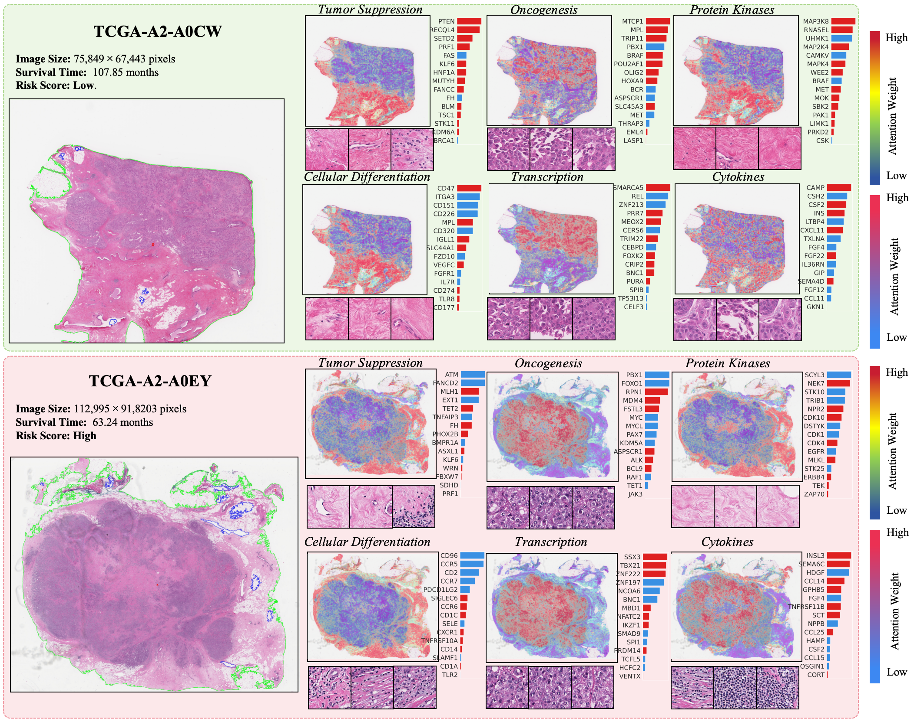

<h1>CFBCT</h1>

**Counterfactual Bidirectional Co-Attention Transformer for Integrative Histology-Genomic Cancer Risk Stratification** , *IEEE Journal of Biomedical and Health Informatics 2025*

Zheyi Ji, Yongxin Ge, Chijioke Chukwudi, Kaicheng U, Sophia Meixuan Zhang, Yulong Peng, Junyou Zhu, Hossam Zaki, Xueling Zhang, Sen Yang, Xiyue Wang, Yijiang Chen, and Junhan Zhao

[Paper](https://github.com/BusyJzy599) | [Cite](#cite)


<details>

<summary> Read full abstract from CFBCT.


</summary>

> **Abstract:**  Applying deep learning to predict patient prognostic survival outcomes using histological whole-slide images (WSIs) and genomic data is challenging due to the morphological and transcriptomic heterogeneity present in the tumor microenvironment. Existing deep learning-enabled methods often exhibit learning biases, primarily because the genomic knowledge used to guide directional feature extraction from WSIs may be irrelevant or incomplete. This results in a suboptimal and sometimes myopic understanding of the overall pathological landscape, potentially overlooking crucial histological insights. To tackle these challenges, we propose the CounterFactual Bidirectional Co-Attention Transformer framework. By integrating a bidirectional co-attention layer, our framework fosters effective feature interactions between the genomic and histology modalities and ensures consistent identification of prognostic features from WSIs. Using counterfactual reasoning, our model utilizes causality to model unimodal and multimodal knowledge for cancer risk stratification. This approach directly addresses and reduces bias, enables the exploration of 'what-if' scenarios, and offers a deeper understanding of how different features influence survival outcomes. Our framework, validated across eight diverse cancer benchmark datasets from The Cancer Genome Atlas (TCGA), represents a major improvement over current histology-genomic model learning methods. It shows an average 2.5% improvement in c-index performance over 18 state-of-the-art models in predicting patient prognoses across eight cancer types.

</details>




## Updates
- **03/04/2025**: The first version of CFBCT codebase is now live! 

## Hardware

- **Storage:** 8TB of storage space for Pan-Cancer datasets.
- **GPU:** NVIDIA GPU (Tested on Nvidia GeForce RTX 3090 x 4) with CUDA 11.7 and cuDNN 8.0

## Env Installation

**Python (3.7.13)**
```txt
h5py==3.7.0
numpy==1.21.6
pandas==1.3.5
Pillow==9.3.0
opencv-python==4.6.0.66
openslide-python==1.2.0
scikit-learn==1.0.2
scipy==1.7.3
tensorboardX==2.6
torch==1.9.1
torchvision==0.10.1
```

# CFBCT Walkthrough


### Step 1: Dataset Organization For Histology Patch Features

To download diagnostic and tissue WSIs (formatted as .svs files), please refer to the [NIH Genomic Data Commons Data Portal](https://portal.gdc.cancer.gov/) and use the [GDC Data Transfer Tool](https://docs.gdc.cancer.gov/Data_Transfer_Tool/Users_Guide/Data_Download_and_Upload/).


1. Using  the pre-trained truncated [CTransPath]( https://github.com/Xiyue-Wang/TransPath) to encode the raw image patches into 768-dimensional feature vectors.


2. The file structure involved in all processing is as follows:

````
|──DATA_ROOT_DIR 						# The base directory of all datasets
│   ├── BLCA                 			# Cancer type
│   │   ├── slide                   	# Raw WSIs downloaded using GDC
│   │   │   ├── a6b073a9-9226-4907-9edb-90070c68ae60
│   │   │   │  ├── TCGA-GV-A40G-01Z-00-DX1.AD1A709F-A10C-4E69-B4ED-6361777361FD.svs
│   │   │   ├── 94c5db73-5025-45c9-8023-1bbc0479426e
│   │   │   │  ├── TCGA-FD-A5BV-01Z-00-DX1.FD47C060-5104-45AC-95F8-0C4C5924FE26.svs...
│   │   ├── tile                        # Tiling images for each WSI
│   │   |    ├── TCGA-GV-A40G-01Z-00-DX1.AD1A709F-A10C-4E69-B4ED-6361777361FD
│   │   |    ├── TCGA-FD-A5BV-01Z-00-DX1.FD47C060-5104-45AC-95F8-0C4C5924FE26...
│   │   └── path_h5    					# Feature embeddings for each case
│   │   |    ├── TCGA-GV-A40G.h5
│   │   |    ├── TCGA-FD-A5BV.h5...
````


### Step 2: Dataset Organization For Genomic Groups


Following previous work (e.g., [MCAT](https://github.com/mahmoodlab/MCAT)), the downloaded gene families containing mutation status, copy number variation, and RNA-Seq abundance were classified (by common features such as homology or biochemical activity). If access to raw molecular data and other clinical metadata, please refer to the [cBioPortal](https://www.cbioportal.org/).


### Step 3: Running Example Experiment

The method proposed in this work can be tested on different cancer samples by running the example code in `Example.ipynb`. 

### Step 4: Visualization

A sample visualization is shown below. Visualization code for Genomics => Histology interactions will be updated soon!




## Acknowledgements
If you find our work useful in your research or if you use parts of this code please cite our paper:
```bibtext
@article{

}
```


